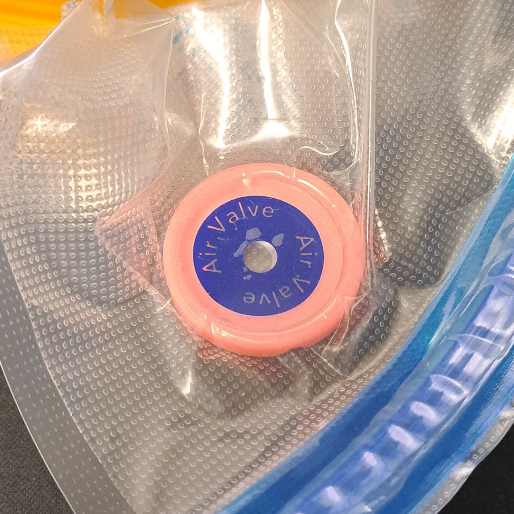

# Air valve helper
Упрощает правильное позиционирование ручного насоса и не даёт ему смещаться в сторону в процессе откачки воздуха. Оставляет каналы для прохода воздуха к клапану. Можно откачивать воздух на любой поверхности, даже положив катушку себе на коленки, не требуется ровная жёсткая поверхность.

