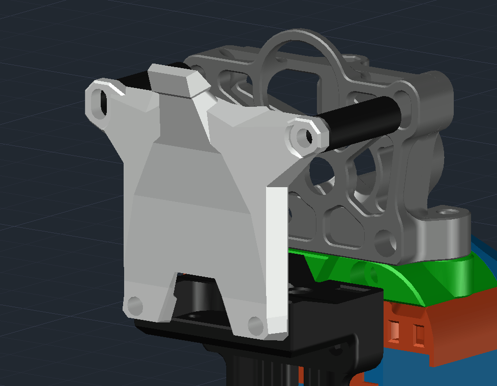

# Mini Sherpa Strain Relief Body
Переработанное крепление проводов, увеличивающее жёсткость общей конструкции для экструдера mini sherpa. Повторяет по конструкции стандартную деталь, но более высокая, для соответствия крепёжным отверстиям.

