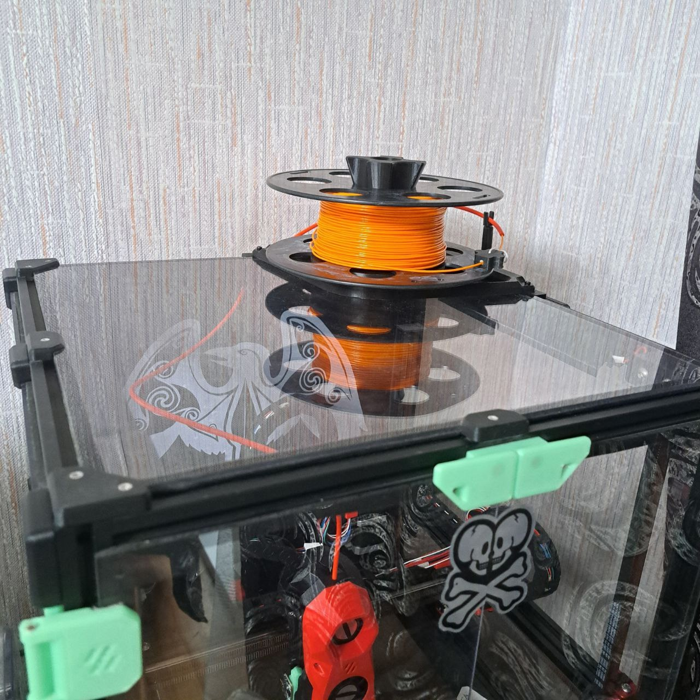
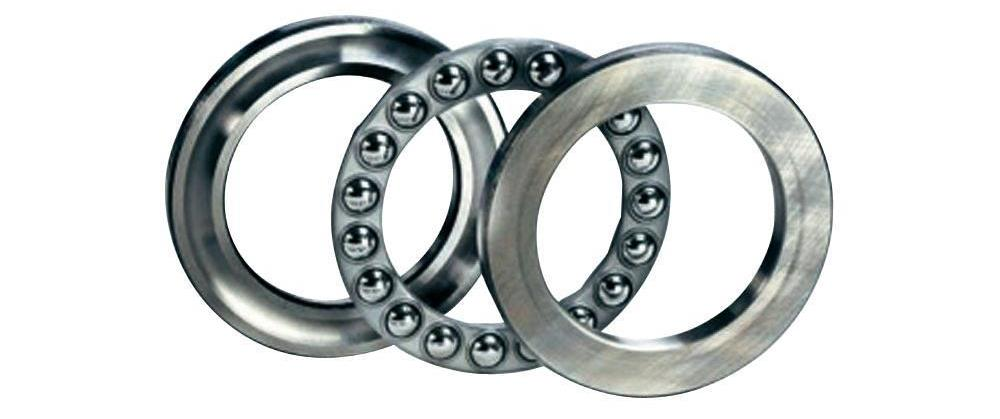
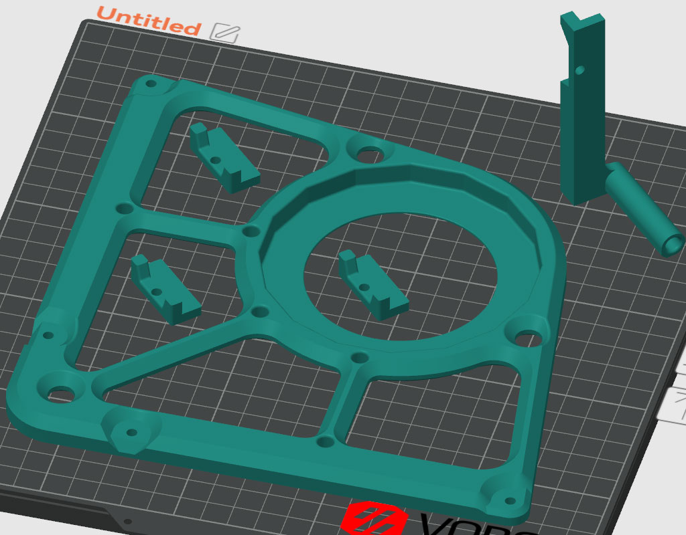
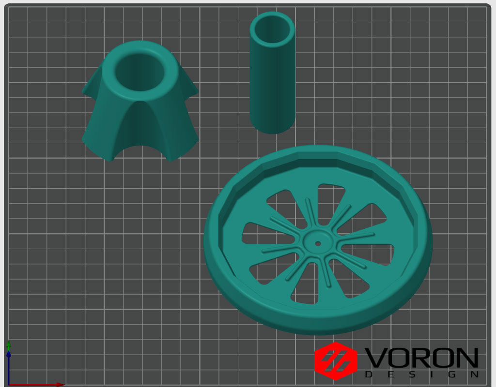

# Горизонтальное расположение катушки
Для сборки нужен 100мм подшипник и длинный винт с гайкой, чтобы прикрутить ось к платформе, либо вплавляемая гайка.

Катушка не жёстко зафиксирована, а просто лежит примерно по центру платформы. Центрирующая гайка нужна именно для центрирования, а не для удержания. Благодаря подшипнику катушка крутится очень легко и равномерно при любой скорости печати.

